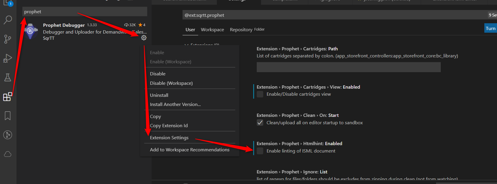

# Isml Linter Extension for VS Code
VS Code extension for Isml Linter. You can also install the linter directly through npm and take advantage of its full-project lint feature, such as use it in the build process. More info here: https://www.npmjs.com/package/isml-linter. There you can also find a set of rules and configurations that can be applied to this extension.

# Sample Result

# Configuration
The Isml Linter configuration file is where the linting rules are defined. This extension will read it from one of the following files in your project root directory, whichever it finds:
 - ismllinter.config.js
 - .ismllinter.json
 - .ismllintrc.js

You can find more info on how to add or remove rules [here](https://www.npmjs.com/package/isml-linter).

# Disable Prophet Occurrences

In case you use Prophet and want only the occurrences reported by Isml Linter to display, you can disable Prophet's lint feature:

# Contributors
 - Railan Barbosa (logo);
