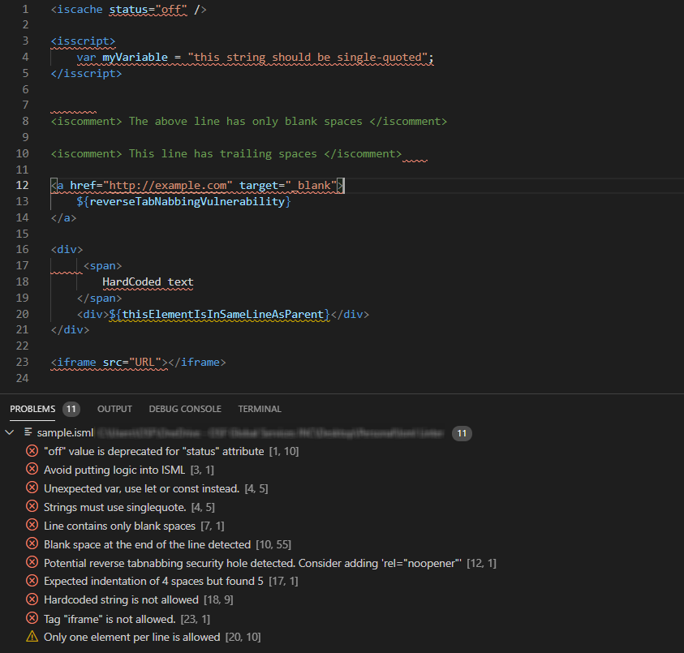

# Isml Linter Extension for VS Code
VS Code extension for Isml Linter. You can also install the linter directly through npm and take advantage of its full-project lint feature, such as use it in the build process. More info here: https://www.npmjs.com/package/isml-linter. There you can also find a set of rules that can be applied to this extension.

# Known Issue
As this is extension is in a Beta version, there are some known issues. It has an incompability with [Prophet Debugger](https://marketplace.visualstudio.com/items?itemName=SqrTT.prophet) extension and we're working to solve this problem as higher priority. If you want to see what this linter can do, temporarily disable Prophet and reload VS Code.

# Sample Result

# Configuration
The isml linter configuration file is where the linting rules are defined.

Currently, the linter is still in a Beta version, thus the config file in the default vscode extensions directory (see below) is used. Ideally, the config file path should be configurable through user or workspace settings, so it could go into a project's repository.

The default configuration file path is displayed below, be it Windows or Unix system.

- (user_directory)/.vscode/extensions/fabiowquixada.vscode-isml-linter-(version)/.ismllinter.json

Edit that file in order to customize the linter. By default, all rules are enabled. You can find more info on how to add or remove rules [here](https://www.npmjs.com/package/isml-linter).

# Contributors
 - Railan Barbosa (logo);
